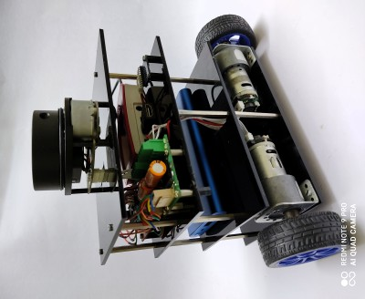

# Jerry Bot

Jerry Bot is a differential drive mobile robot based on Robot Operating System (ROS). Its working on Ubuntu 20.04 with ROS Noetic. It has DC Gear motors with encoders, Raspberry Pi 4 and an RPLidar A1 as its main components. It uses Arduino Nano to interface between the hardware and Raspberry pi running ROS.

# To Use JerryBot
To run the JerryBot simulation in Gazebo, clone the package in your catkin workspace, and use the launch file below.

```console
cd ~/catkin_ws/src
git clone https://github.com/sakthibalanv/jerry_bot.git
cd ~/catkin_ws
catkin_make
source devel/setup.bash
```

# To Launch JerryBot in Gazebo
```console
roslaunch jerry_bot_gazebo jerry_turtlebotworld.launch
```


## Jerry Physical Robot
Jerry Bot Making video can be found on the link below
[](https://www.youtube.com/watch?v=2tfIN2R6Qrg)





## Jerry Simulation Model


## Jerry Bot Navigation Video Links
[](https://www.youtube.com/watch?v=WxPS_vEyv7k)


## Jerry Bot Navigation in Narrow Door space

[](https://www.youtube.com/watch?v=2JQMv-HHEQY)

## Further Work
* Using IMU and EKF package for better pose estimate.
* Interfacing Raspberry Pi camera for vision applications.
* Adding a depth camera for navigation.
* Battery monitering and automatic charging.

## Contributions
Your contributions are most welcomed.

